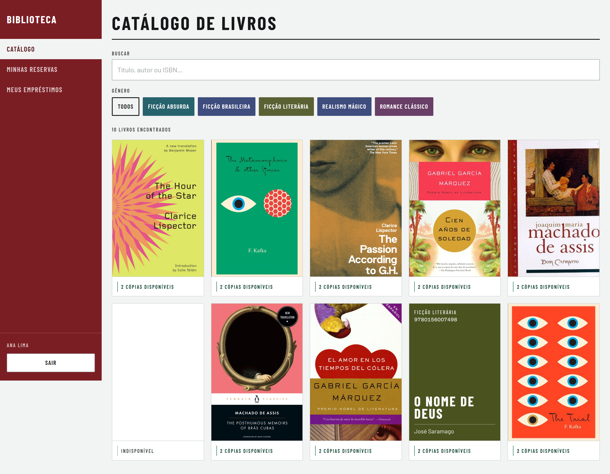
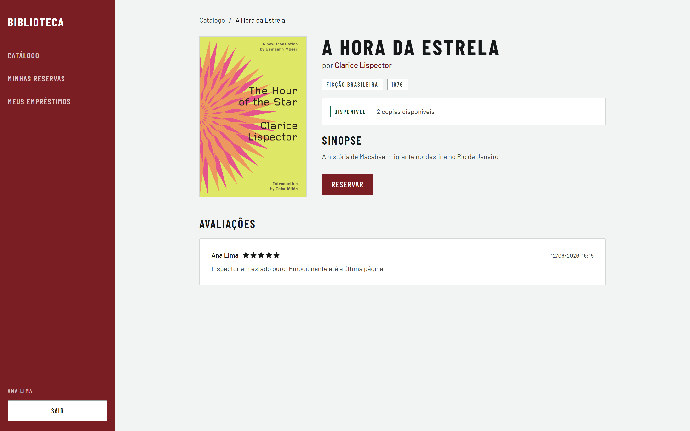
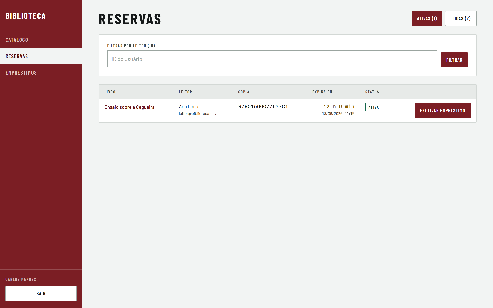

# Sistema de Biblioteca

Sistema web híbrido de catálogo, reservas e empréstimos de biblioteca.

## 📸 Telas

Fluxo híbrido do produto: o **Leitor** navega o catálogo e reserva on-line; o **Bibliotecário** acompanha e efetiva o empréstimo presencialmente.

### Catálogo de Livros (Leitor)



### Detalhes do Livro e Reserva (Leitor)



### Painel do Bibliotecário — Reservas



> Capturas geradas com Playwright a partir da UI real (`e2e/`).

## Rodar em 3 comandos

```bash
cp .env.example .env
make setup    # instala dependências e sobe o banco via docker compose
make dev      # inicia API (porta 3000) e Web (porta 5173) em modo watch
```

## Comandos disponíveis

```bash
make setup    # instala deps + docker compose up + prisma migrate + seed
make dev      # inicia API + Web em modo watch
make test     # roda testes unitários e de integração (Vitest)
make test-e2e # roda testes E2E (Playwright)
make lint     # ESLint + TypeScript typecheck
make build    # build de produção (api + web)
make migrate  # aplica migrations Prisma pendentes
make seed     # popula banco com dados de desenvolvimento
```

### Observabilidade

A stack de observabilidade (OpenTelemetry Collector, Prometheus, Grafana, Jaeger
e Graylog) fica no perfil `obs` do `docker-compose.yml` e **não** sobe com
`docker compose up -d`:

```bash
make obs-up         # sobe a stack e provisiona o input do Graylog
make obs-status     # verifica logs, métricas e traces de ponta a ponta
make obs-down       # para a stack preservando os dados
make obs-dashboards # recaptura os screenshots dos dashboards
```

Quatro dashboards em http://localhost:3001 (pasta `Biblioteca`): Negócio, SLO de
Performance, Saúde da API e um importado do marketplace da Grafana sobre as
métricas HTTP default do OTel SDK. O JSON versionado em
`observabilidade/grafana/dashboards/` é a fonte de verdade — editar pela
interface não persiste. Para popular os painéis antes de capturar, use a carga
K6 de [`perf/`](perf/README.md).

Detalhes em [`docs/observabilidade.md`](docs/observabilidade.md).

## Estrutura

```
packages/
├── api/          # API REST (Node.js 20 + Express + TypeScript)
├── web/          # SPA (React 18 + TypeScript)
└── shared/       # Tipos compartilhados gerados do schema
```

## Documentação

| Documento | O que responde |
|---|---|
| [`AGENTS.md`](AGENTS.md) | Como escrever código neste projeto |
| [`ARCHITECTURE.md`](ARCHITECTURE.md) | Onde ficam as coisas e quais fronteiras não se atravessa |
| [`DESIGN.md`](DESIGN.md) | O mundo visual: tokens, componentes e regras da interface |
| [`docs/prd-sistema-biblioteca.md`](docs/prd-sistema-biblioteca.md) | O que construir e por quê |
| [`docs/produto/PRODUCT.md`](docs/produto/PRODUCT.md) | Usuários, propósito, princípios e compromissos do produto |
| [`docs/produto/glossario.md`](docs/produto/glossario.md) | Linguagem ubíqua do domínio |
| [`docs/produto/user-stories.md`](docs/produto/user-stories.md) | Histórias com critério de aceite testável |
| [`docs/design/fluxos.md`](docs/design/fluxos.md) | Fluxos principais com estados de erro |
| [`docs/observabilidade.md`](docs/observabilidade.md) | Como o backend é observado: logs, métricas, traces e dashboards |
| [`docs/decisoes/`](docs/decisoes/) | ADRs das decisões estruturantes |
| [`docs/arquitetura/c4-contexto.md`](docs/arquitetura/c4-contexto.md) | Diagrama C4 do sistema |
| [`perf/README.md`](perf/README.md) | Testes de carga K6 e os alvos de latência do PRD |

## Variáveis de ambiente

Copie `.env.example` para `.env` e preencha os valores. Nunca commite `.env`.

## Pré-requisitos

- Node.js 20+
- Docker + Docker Compose
- `make`

## Melhorias futuras

### Buscar o Leitor por nome ou e-mail no balcão

O [Fluxo 2](docs/design/fluxos.md) descreve o Bibliotecário localizando o Leitor
que acabou de chegar ao balcão. Hoje isso só é possível pelo **ID exato** do
usuário: `findAllReservations` e `findLoans` filtram por `where: { userId }`,
correspondência exata — não há busca parcial, por nome nem por e-mail.

Na prática, o Leitor que chega para retirar o livro não sabe o próprio UUID e o
Bibliotecário não tem como obtê-lo pela pessoa à sua frente. O filtro por ID
serve para suporte e depuração; **não serve para atender no balcão**. O fluxo
funciona hoje porque a lista de Reservas ativas é curta o bastante para ser lida
na tela — o que deixa de valer na escala de 10.000 Leitores prevista no PRD.

Implementar exige mudança na API, não apenas na interface:

- aceitar um termo de busca livre em `GET /reservations` e `GET /loans`, além do
  `userId` atual;
- casar o termo contra nome e e-mail do Leitor, com correspondência parcial e
  sem diferenciar acentos ou caixa;
- paginar o resultado — hoje as duas rotas devolvem arrays sem limite.

Enquanto isso não existe, a etapa "ler linha" do balcão depende de rolagem, e a
página de Reservas abre filtrada em **Ativas** justamente para encurtá-la.
