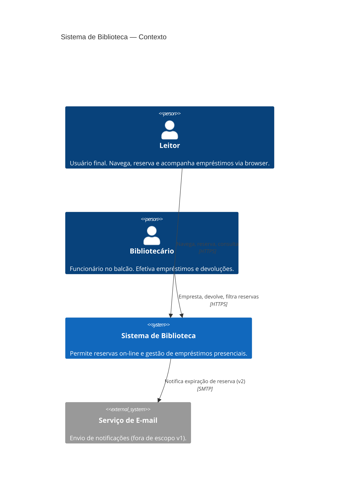
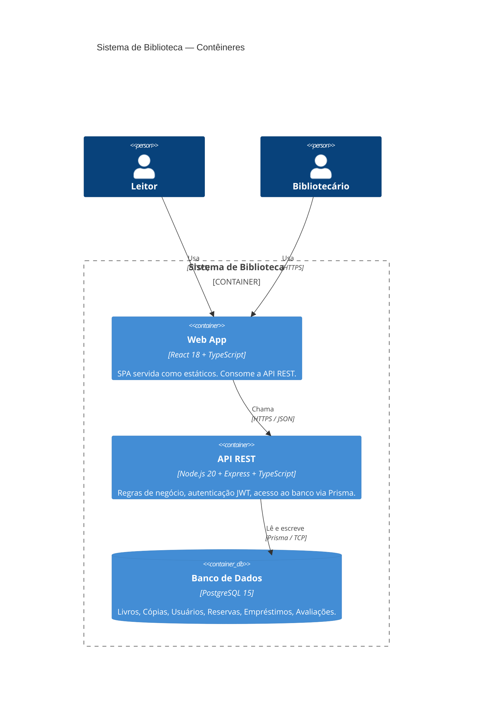
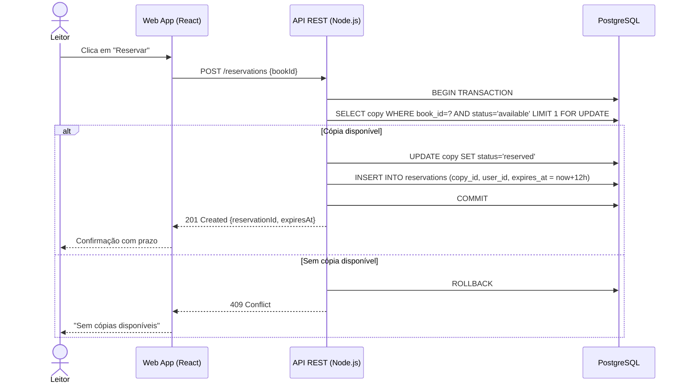

# Arquitetura C4 — Sistema de Biblioteca

> Nível 1 (Contexto) e Nível 2 (Contêineres).
> Versionado em Mermaid — o agente lê e atualiza quando um contêiner muda.

---

## Nível 1 — Diagrama de Contexto

---

## Nível 2 — Diagrama de Contêineres

---

## Fluxo de dados — reserva de livro

