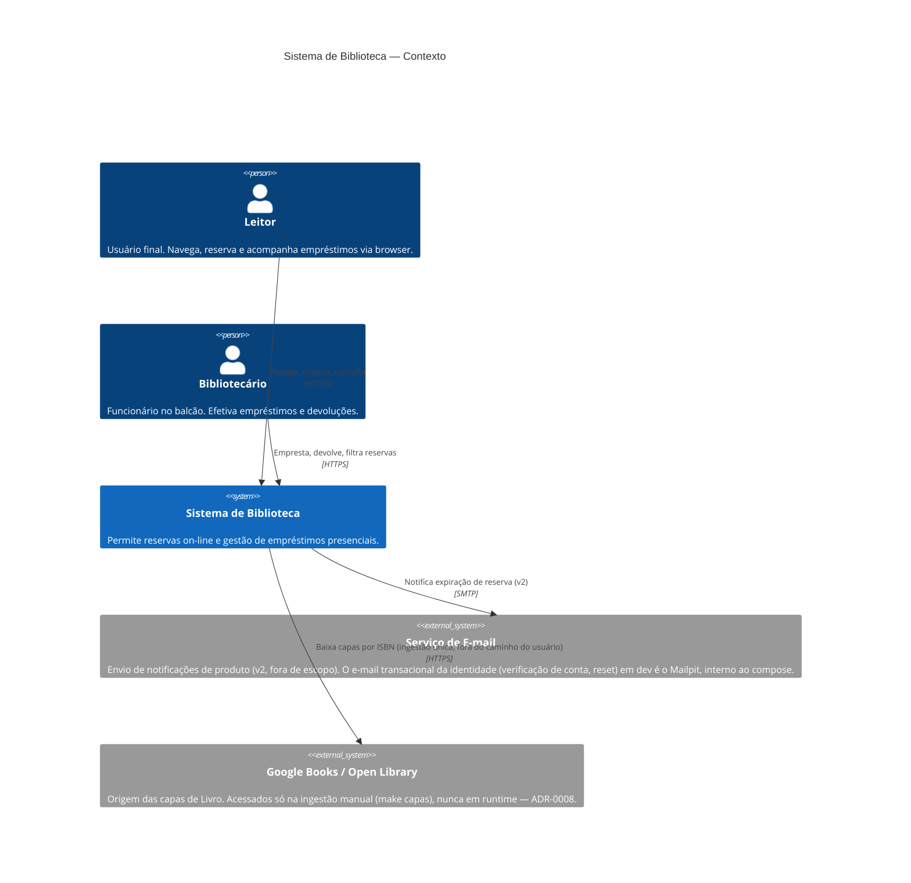
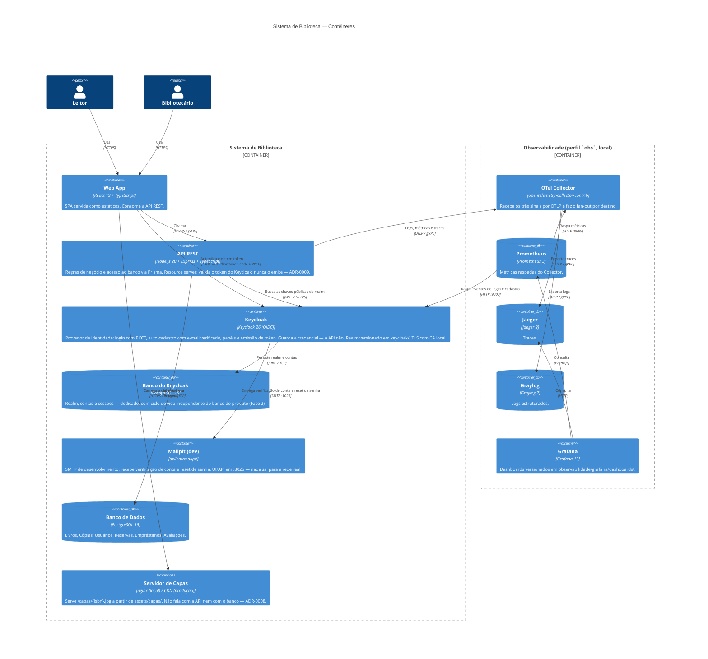
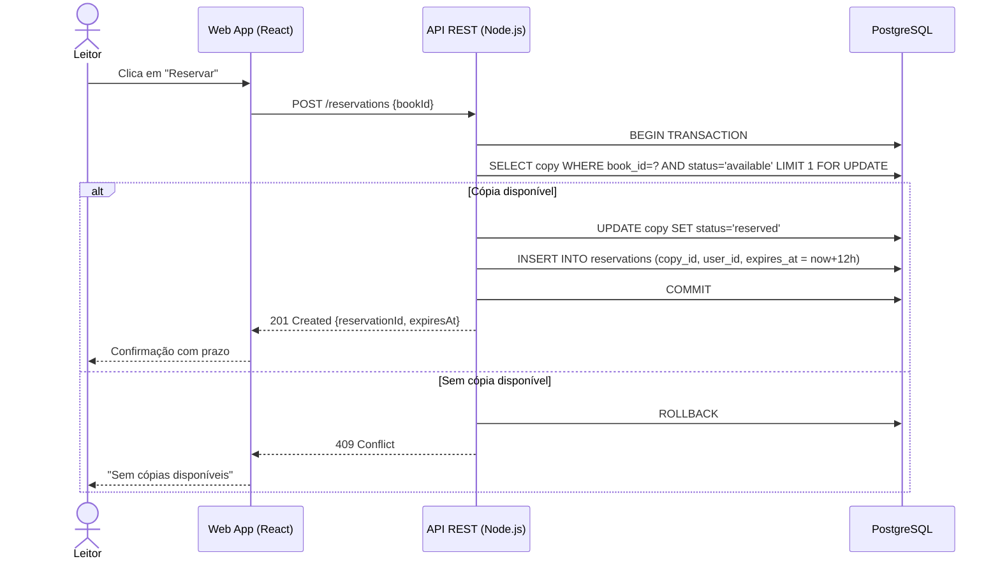

# Arquitetura C4 — Sistema de Biblioteca

> Nível 1 (Contexto) e Nível 2 (Contêineres).
> Versionado em Mermaid — o agente lê e atualiza quando um contêiner muda.

---

## Nível 1 — Diagrama de Contexto

---

## Nível 2 — Diagrama de Contêineres

> O Keycloak **sobe** com `make db-up` (que gera antes a CA local do TLS):
> sem ele ninguém autentica. Responde em https://localhost:8443 com
> `sslRequired: all` — token não trafega em claro, nem em localhost. A senha
> nunca atravessa a nossa origem — o navegador fala com ele diretamente, e a
> API só recebe o token pronto.
>
> A stack de observabilidade **não sobe** com `docker compose up -d` — vive no
> perfil `obs` e é ferramenta de desenvolvimento, não parte do produto entregue.
> Detalhes em [ADR-0007](../decisoes/0007-observabilidade.md) e
> [observabilidade.md](../observabilidade.md).

---

## Fluxo de dados — reserva de livro

