# Layout responsivo — as sete telas nas três larguras

> Registro do que foi medido, corrigido e garantido na issue #21. Os tokens e as
> regras do mundo visual continuam no [`DESIGN.md`](../../DESIGN.md); aqui ficam
> **as larguras, o que muda em cada uma e como isso é verificado**.

## Larguras de referência

| Faixa | Largura | Breakpoint | O que a tela faz |
|---|---|---|---|
| Smartphone | 390px | base | Trilho no topo, tabela em ficha, grade de 2 colunas, ações de Modal empilhadas |
| Tablet em retrato | 768px | `md` | Trilho no topo, tabela em ficha, grade de 4 colunas |
| Tablet em paisagem | 1024px | `lg` | Trilho no topo, **tabela de volta** com 976px de campo, grade de 5 colunas |
| Desktop | ≥ 1280px | `xl` | Trilho vira coluna fixa de 240px |

## As três decisões

**1. O trilho de zona só vira coluna lateral em `xl` (1280px), não em `lg`.**
Os 240px da lateral saíam justamente da largura de que a tabela do balcão
precisa: em 1024px sobravam 734px de contêiner para uma tabela que pede 740, e
"Efetivar empréstimo" — a coluna de ação, a tarefa que a tela existe para
cumprir — saía do quadro dentro de um `overflow-x: auto`, sem barra de rolagem
de página que denunciasse. Abaixo de `xl` o trilho cobra altura no topo, que é
barata, e devolve largura ao registro, que é escassa.

**2. A tabela empilha em ficha abaixo de `lg` (1024px), não abaixo de `sm`.**
O limiar é a largura que a tabela precisa, não o tamanho do aparelho. A tabela
de Reservas do Bibliotecário tem seis colunas e a última é a ação; no tablet em
retrato ela pedia 740px dentro de 718px. A ficha — cabeçalho em `sr-only`, um
rótulo por célula vindo de `data-coluna`, ação em largura cheia — já existia
para o celular desde antes; esta issue só reconheceu que a faixa de tablet tem
o mesmo problema, e por isso a regra deixou de se chamar "no celular".

**3. Alvo de toque de 44×44 é piso, e o piso segue o ponteiro.**
`.link-registro` e o novo `.link-caminho` (o link do breadcrumb, que media
54×17) sobem de 24px para 44px em `@media (pointer: coarse)`: o Bibliotecário
com mouse continua varrendo uma lista densa, e o Leitor com o polegar acerta o
alvo. O botão de fechar do Modal ganhou `min-w-[44px]` — o `.btn-sm` garantia
os 44px só na altura, e o ícone de 20px deixava a largura em 28px.

Ajustes menores da mesma varredura: o padding lateral do link de zona cai para
12px no celular (as três zonas do Leitor cabem em 390px sem rolar), a grade do
catálogo ganha a quinta coluna em `lg` em vez de `xl` (é onde o trilho devolve
os 240px), e o rodapé do Modal empilha em largura cheia abaixo de `sm` — lado a
lado, "Manter reserva" + "Cancelar reserva" pediam 342px dentro dos 310
disponíveis.

## Como isso fica verificado

[`e2e/responsivo.spec.ts`](../../e2e/responsivo.spec.ts) percorre as sete telas
nas três larguras, com toque emulado (sem isso o Chromium reporta ponteiro fino
e as regras de 44px nem entram na conta), e afirma quatro coisas por tela:

1. a página não rola na horizontal;
2. nenhum elemento visível ultrapassa o quadro;
3. nenhum contêiner (`.table-container`, `.card`, `main`, `.modal`) esconde
   conteúdo num overflow horizontal — a exceção declarada é a faixa de zonas do
   trilho, que rola por desenho;
4. todo controle visível tem 44×44.

Roda junto com a suíte (`make e2e`), sem criar Reserva nem Empréstimo. Link no
meio de frase fica de fora da varredura de alvos: a WCAG 2.5.8 abre exceção para
ele, e engordar um link inline quebraria a linha da prosa.

## Como as capturas nascem

Um mecanismo só: `make screenshots` roda `e2e/screenshots.spec.ts`, que grava em
`assets/images/` nas três molduras. A moldura larga mantém o nome simples
(`catalogo.png`) e as estreitas acrescentam o sufixo do aparelho:

```
assets/images/catalogo.png              1440×900  (README)
assets/images/catalogo-smartphone.png    390×844
assets/images/catalogo-tablet.png        768×1024
```

Captura feita à mão sai do lugar no primeiro ajuste de UI — por isso nenhuma
imagem deste documento é tirada de outro jeito. A tela de entrada só tem captura
larga: quem pede a credencial é o Keycloak (ADR-0009), e o layout daquela tela é
produto de terceiro.

## O resultado, tela a tela

### Catálogo

| Smartphone (390px) | Tablet (768px) |
|---|---|
| 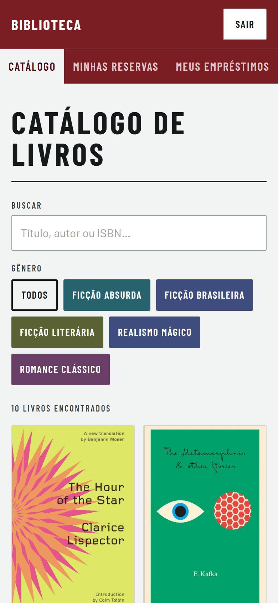 | 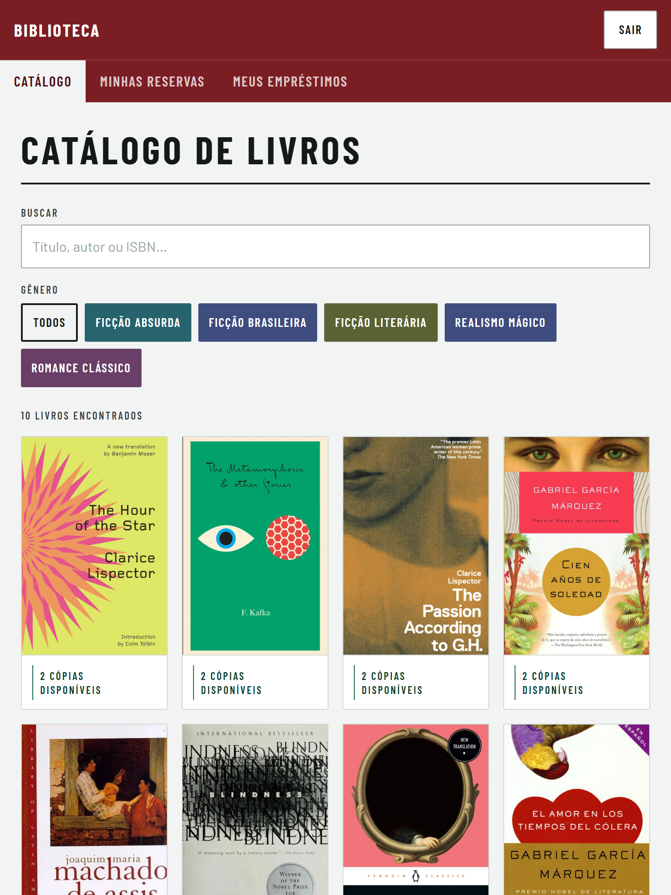 |

### Detalhes do Livro e confirmação de Reserva

| Smartphone (390px) | Tablet (768px) |
|---|---|
| 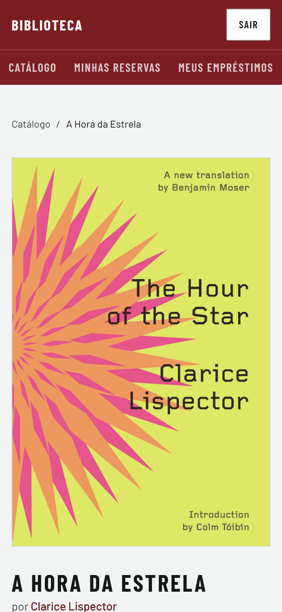 | 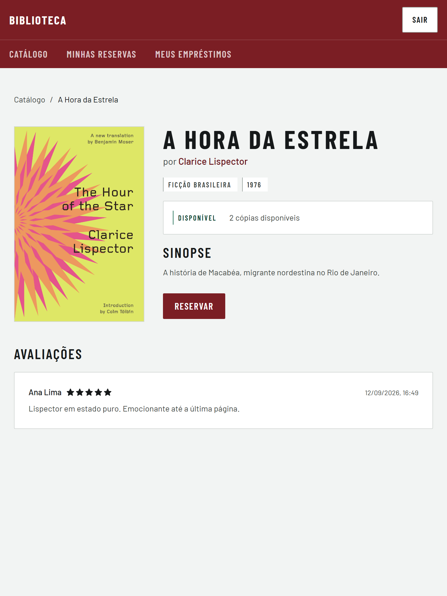 |

O rodapé do Modal empilhado, com a ação primária em cima:

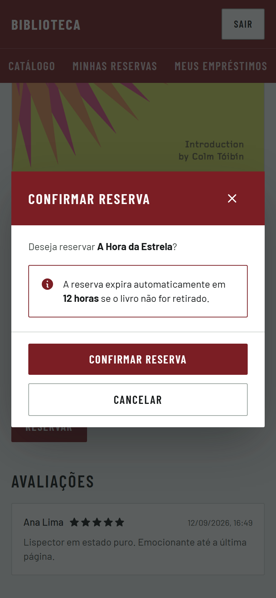

### Detalhes do Autor

| Smartphone (390px) | Tablet (768px) |
|---|---|
| 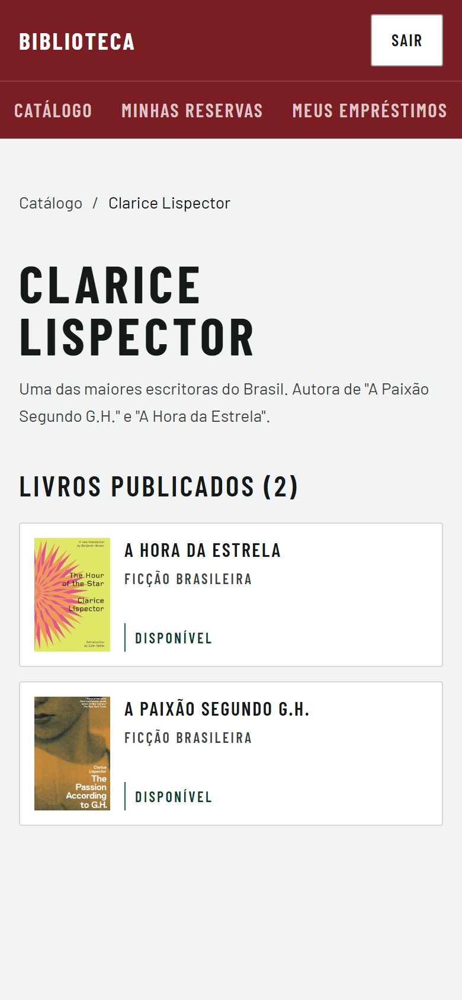 | 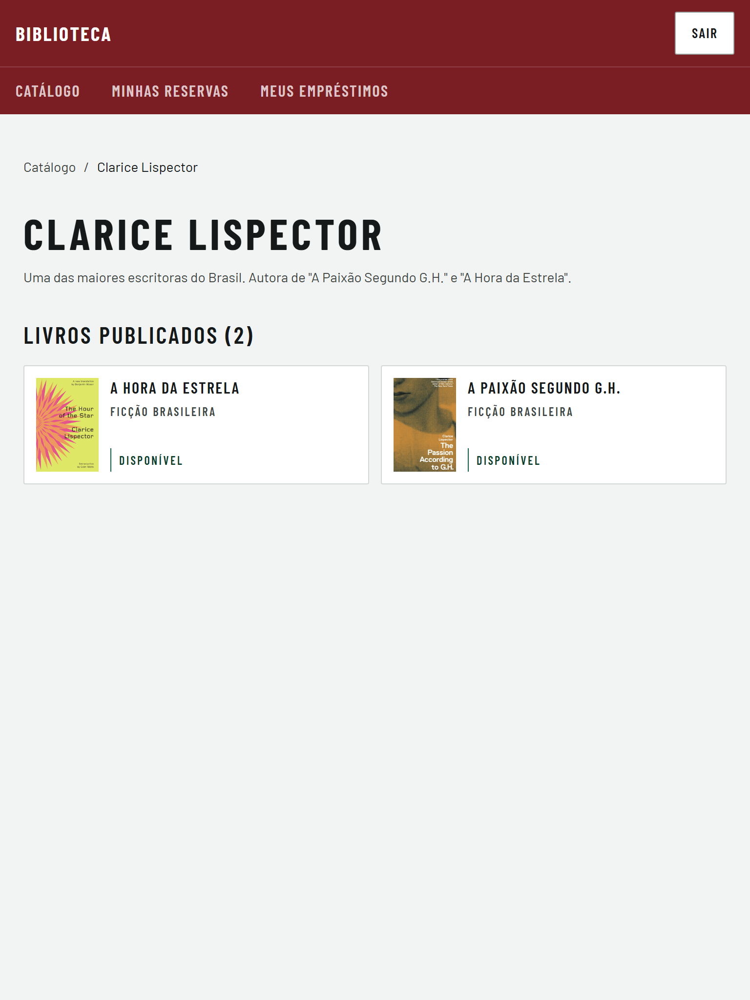 |

### Minhas Reservas e Meus Empréstimos

| Smartphone (390px) | Tablet (768px) |
|---|---|
| 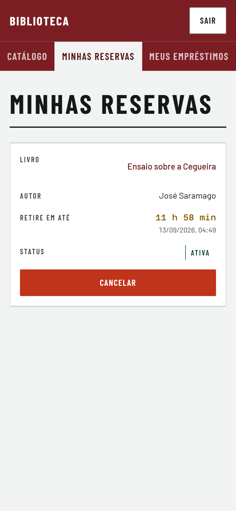 | 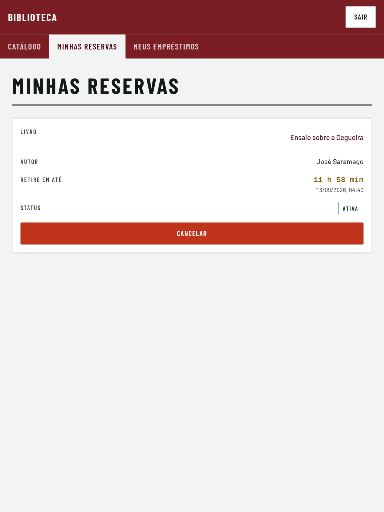 |
| 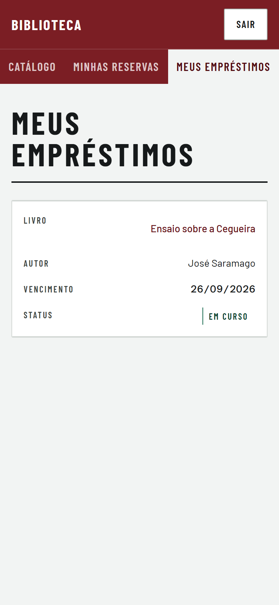 | 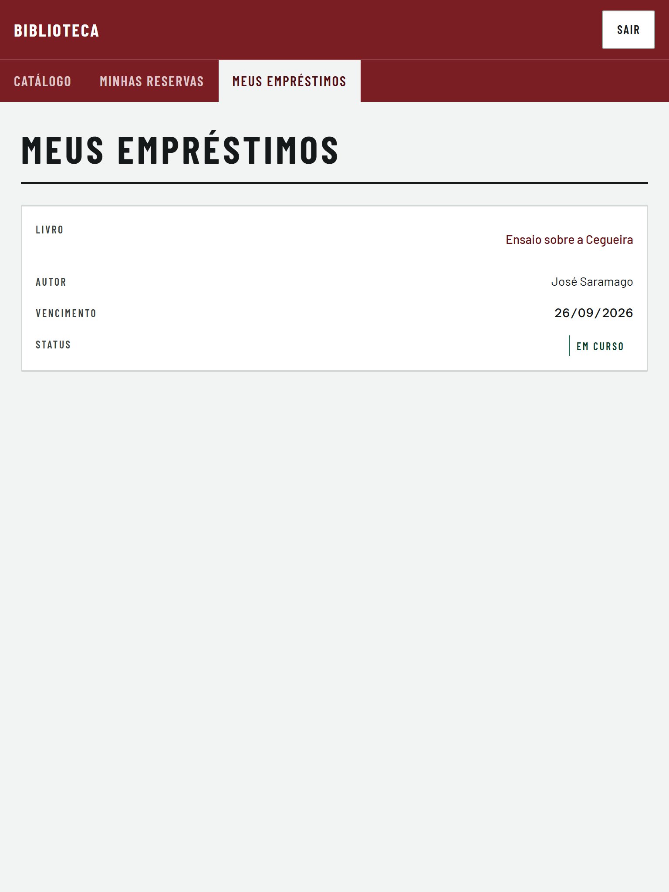 |

### Balcão do Bibliotecário

A ficha com a ação em largura cheia é o que mantém "Efetivar empréstimo" e
"Registrar devolução" na tela:

| Smartphone (390px) | Tablet (768px) |
|---|---|
| 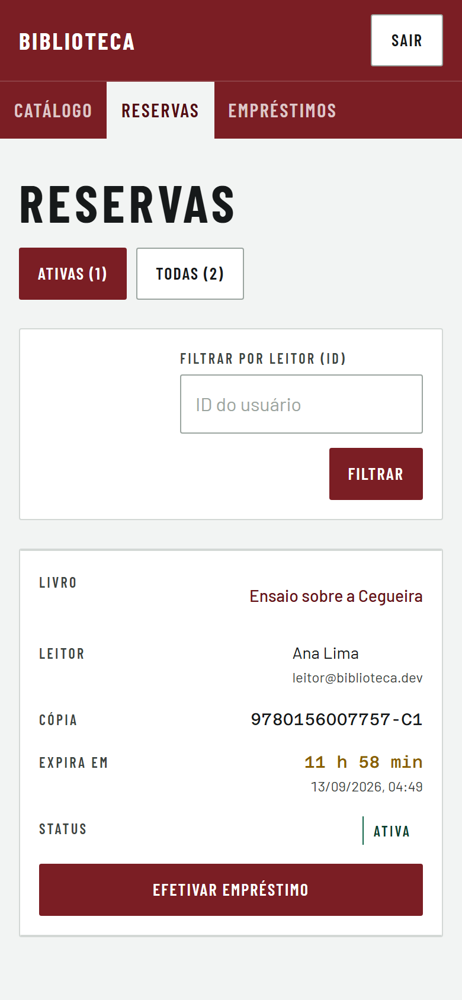 | 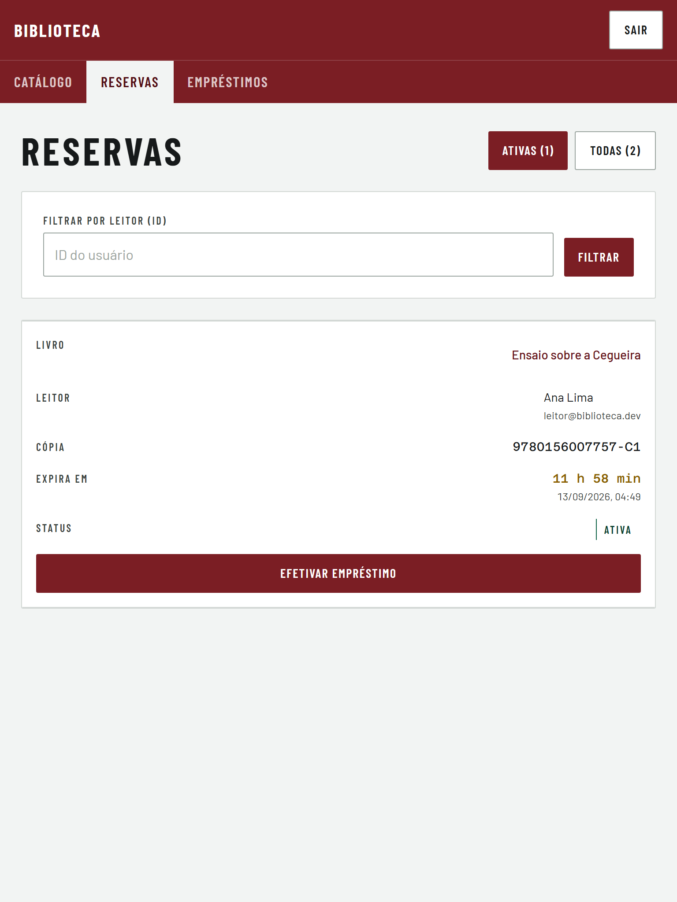 |
| 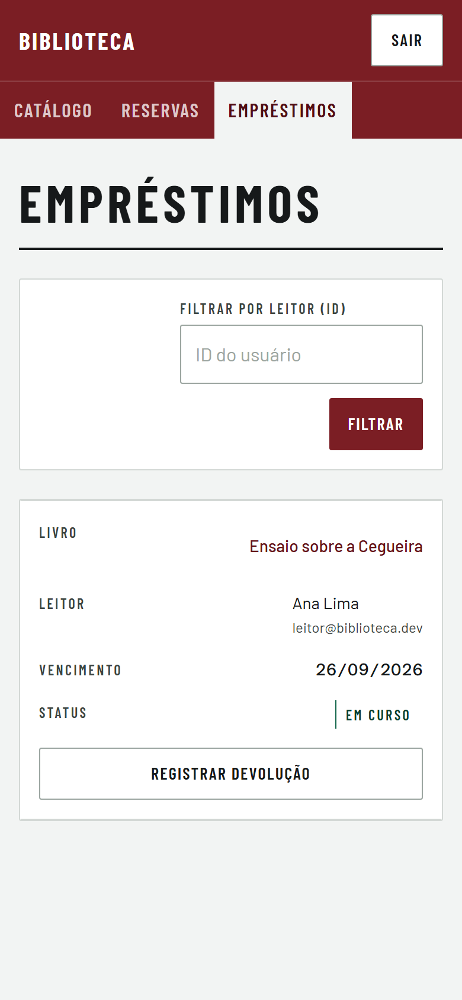 | 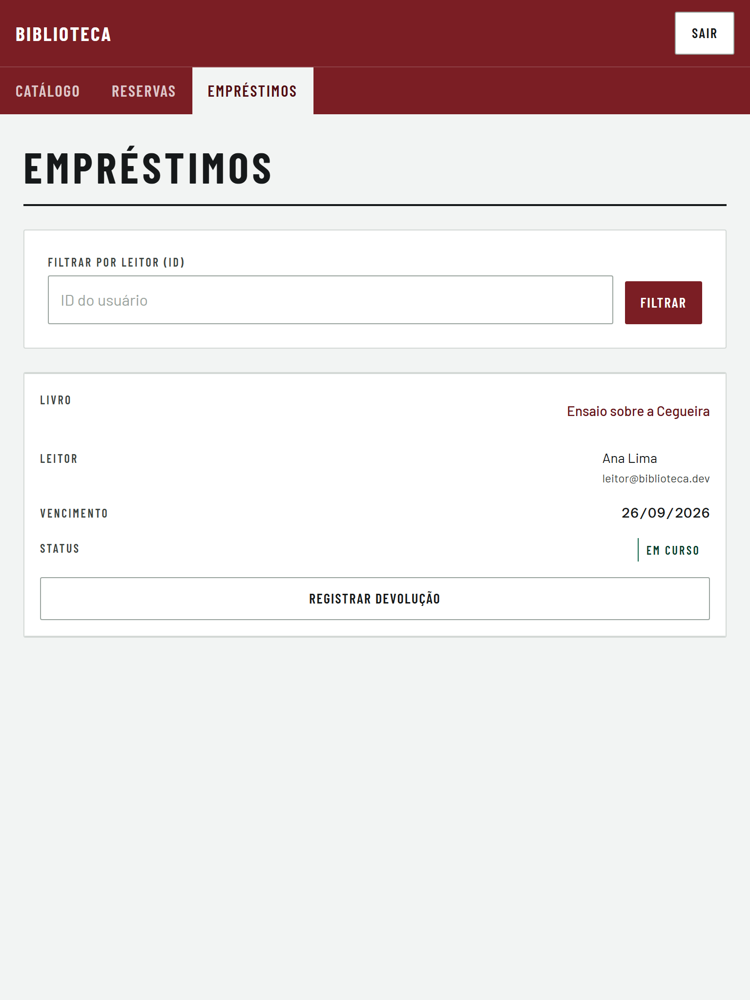 |

## O que continua em aberto

- **Tablet em paisagem não tem captura versionada.** Ele é verificado pelo spec
  em 1024px, mas as imagens ficariam a um passo das de desktop — a diferença é o
  trilho no topo — e não pagariam o peso no repositório.
- **A varredura mede as telas com os dados do seed.** Título, nome de Leitor e
  e-mail mais longos que os do seed empurram a largura mínima da tabela; o
  limiar de `lg` foi escolhido com folga por isso, mas não há teste com dados
  extremos.
- **Orientação não é testada.** Girar o aparelho troca a largura, e é a largura
  que decide tudo aqui — mas nenhum teste faz a rotação com a tela montada.
