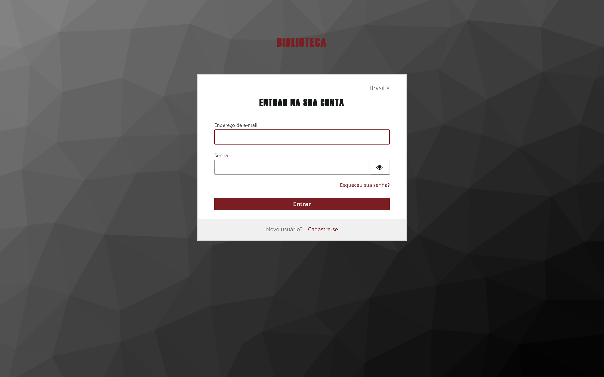
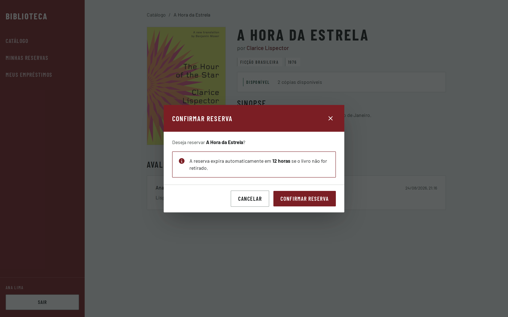
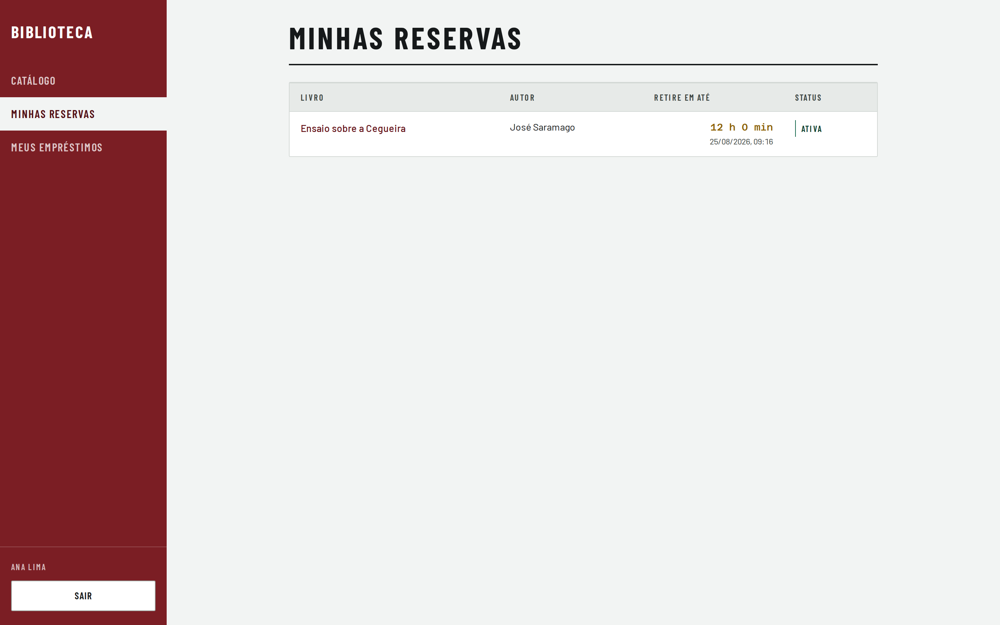
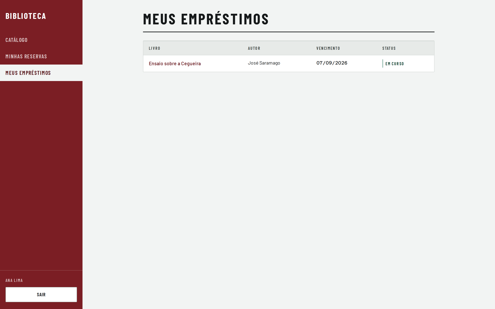
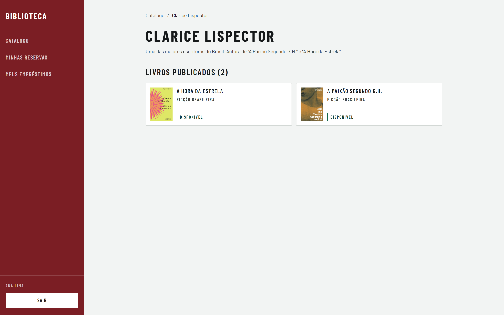
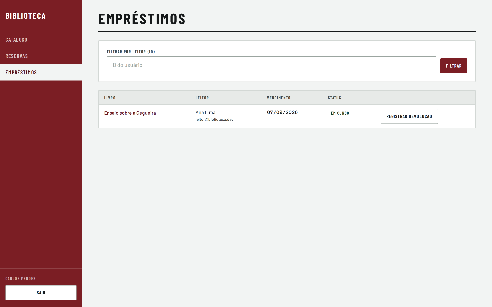

# Manual do Usuário — Sistema de Biblioteca

Este manual explica, passo a passo, como usar a aplicação web da biblioteca.
Ele serve a dois públicos:

- **Leitor** — navega o Catálogo, reserva Livros on-line e acompanha seus Empréstimos.
- **Bibliotecário** — opera o balcão: efetiva Empréstimos e registra Devoluções.

O fluxo do produto é **híbrido**: a Reserva acontece on-line, mas a retirada é
sempre presencial. Ao reservar, uma Cópia física fica separada para você por até
**12 horas**; retire-a na biblioteca dentro desse prazo.

## Sumário

1. [Visão geral](#1-visão-geral)
2. [Acesso e login](#2-acesso-e-login)
3. [Guia do Leitor](#3-guia-do-leitor)
4. [Guia do Bibliotecário](#4-guia-do-bibliotecário)
5. [Perguntas frequentes](#5-perguntas-frequentes)
6. [Problemas comuns](#6-problemas-comuns)

---

## 1. Visão geral

| Papel | O que faz | Telas |
|---|---|---|
| Visitante | Consulta o Catálogo sem conta | Catálogo, Detalhe do Livro, Detalhe do Autor |
| Leitor | Reserva Livros e acompanha prazos | + Minhas Reservas, Meus Empréstimos |
| Bibliotecário | Atende o balcão: Empréstimo e Devolução | + Reservas (balcão), Empréstimos (balcão) |

O ciclo de vida de uma Cópia é:

```
disponível → reservada → emprestada → disponível
```

- Ao **reservar**, a Cópia fica bloqueada para os outros Leitores.
- Se ninguém retirar em **12 horas**, a Reserva expira sozinha e a Cópia volta ao acervo.
- O **Bibliotecário** efetiva o Empréstimo no balcão; a Devolução devolve a Cópia ao acervo.

Cada Usuário tem exatamente um papel (`leitor` ou `bibliotecario`). Toda conta nova nasce Leitor.

---

## 2. Acesso e login

### 2.1 Entrar

1. Acesse a aplicação e clique em **Entrar** no topo da tela (ou em "Entre para reservar este livro" na página de um Livro).
2. Você será levado à **tela de login do Keycloak** — é ela quem pede seu e-mail e senha, não a aplicação da biblioteca.



3. Depois de entrar, você volta para o Catálogo já autenticado. Seu nome aparece no canto inferior esquerdo, junto do botão **Sair**.

> Em ambiente local, o Keycloak roda em `https://localhost:8443`. Para o navegador confiar no certificado, importe `keycloak/certs/ca.crt`.

### 2.2 Criar conta (auto-cadastro)

1. Na tela de login do Keycloak, clique em **Cadastre-se**.
2. Preencha nome, e-mail e senha — a senha precisa ter **no mínimo 12 caracteres**.
3. A conta só fica ativa após **confirmar o e-mail**: em ambiente local a mensagem chega no Mailpit (`http://localhost:8025`). Abra o link de verificação e defina sua senha.
4. De volta à tela de login, entre com suas credenciais.

### 2.3 Esqueci a senha

Na tela de login do Keycloak, use **Esqueceu sua senha?** e siga as instruções enviadas por e-mail (no Mailpit, em ambiente local).

### 2.4 Sair

Clique em **Sair** no trilho de zonas (à esquerda no desktop, no topo no mobile). A sessão se encerra no Keycloak e você volta à tela de login.

---

## 3. Guia do Leitor

### 3.1 Navegar o Catálogo

O Catálogo é a entrada pública do sistema — não precisa de conta para consultar.


- **Buscar**: digite título, autor ou ISBN. O resultado atualiza conforme você digita.
- **Gênero**: clique numa faixa de gênero para filtrar; **Todos** limpa o filtro.
- **Paginação**: 20 Livros por página, com os botões **Anterior** e **Próxima** no pé da lista.
- Cada card mostra a capa e a Disponibilidade ("N cópias disponíveis" ou **Indisponível**).

### 3.2 Ver detalhes de um Livro

Clique num card do Catálogo para abrir a página de detalhes.


Nela você encontra:

- Capa, título, autor (com link para a página dele), gênero e ano;
- **Disponibilidade** atual — o mesmo estado que o balcão vê;
- **Sinopse**;
- **Avaliações** mais recentes de outros Leitores, com nota de 1 a 5.

### 3.3 Reservar um Livro

1. Na página do Livro, com Disponibilidade maior que zero, clique em **Reservar**.
   - Sem sessão ativa, a página mostra "Entre para reservar este livro".
   - Com Disponibilidade zero, o botão vira **Indisponível**.
2. No modal **Confirmar reserva**, leia o aviso: *a reserva expira automaticamente em 12 horas se o livro não for retirado*.



3. Clique em **Confirmar reserva**. Um alerta verde confirma e informa a data-hora limite de retirada.

A partir desse momento a Cópia está separada para você.

### 3.4 Acompanhar Minhas Reservas

No menu **Minhas Reservas** ficam todas as suas Reservas.



- A coluna **Retire em até** mostra primeiro quanto tempo falta (contagem regressiva) e, abaixo, a data-hora limite.
- A coluna **Status** indica o estado da Reserva (Ativa, Expirando, Expirada).
- Quando alguma Reserva tem menos de 1 hora de vida, um alerta amarelo **Retirada urgente** sobe a lista.
- Reserva expirada não desaparece do histórico: ela permanece listada como Expirada, e a Cópia voltou ao acervo.

### 3.5 Acompanhar Meus Empréstimos

No menu **Meus Empréstimos** está o histórico completo.



- **Vencimento**: data limite para devolver. Por padrão são **7 dias corridos** desde a retirada (o Balcão pode ajustar esse prazo).
- **Status**: **Em curso** ou **Devolvido**. Passou do vencimento sem Devolução, aparece o rótulo **Vencido**.

### 3.6 Ver a página de um Autor

Pelo nome do autor em qualquer página de Livro você chega à página dele, que reúne todos os Livros do autor presentes no acervo.



---

## 4. Guia do Bibliotecário

As telas do balcão exigem o papel `bibliotecario` — um Leitor comum não as vê no menu e recebe bloqueio se tentar acessá-las direto pela URL.

### 4.1 Painel de Reservas do balcão

Menu **Reservas**: é por aqui que começa o atendimento do Leitor que chegou para retirar.


- Os botões **Ativas** e **Todas** alternam o filtro, com contador em cada um. O painel abre em **Ativas** — a lista que interessa no balcão.
- **Filtrar por leitor (ID)**: cole o ID do usuário e clique em **Filtrar** para ver só as Reservas dele; **Limpar** remove o filtro.
- Cada linha mostra Livro, Leitor (nome e e-mail), código da **Cópia** a entregar, quanto tempo falta para expirar e o Status.
- A contagem regressiva recalcula sozinha: uma Reserva que expira com a tela aberta sai da lista Ativas e perde o botão de Efetivar.

### 4.2 Efetivar empréstimo

Com o Leitor na frente do balcão e o Livro em mãos:

1. Localize a Reserva ativa (pela lista ou pelo filtro de ID).
2. Clique em **Efetivar empréstimo** na linha.
3. No modal **Efetivar empréstimo** confira Livro, Leitor e o código da Cópia a entregar.
4. O campo **Devolução até** vem preenchido com o padrão de **7 dias corridos** — ajuste se necessário.
5. Clique em **Confirmar empréstimo**.

Se a Reserva expirar entre o clique e a confirmação, o modal avisa: *a Reserva expirou e a Cópia voltou ao acervo — peça ao Leitor para reservar novamente*. A seleção continua aberta para você resolver sem reencontrar a linha.

### 4.3 Registrar devolução

Menu **Empréstimos**: lista os Empréstimos do sistema, com Livro, Leitor, Vencimento e Status.



1. Na linha do Empréstimo em curso (use o filtro por ID do Leitor para encurtar), clique em **Registrar devolução**.
2. No modal **Confirmar devolução**, confirme Livro e Leitor.
3. Clique em **Confirmar devolução** — a Cópia volta ao acervo e fica disponível para nova Reserva.

A Devolução não tem desfazer.

---

## 5. Perguntas frequentes

**Quanto tempo tenho para retirar o livro depois de reservar?**
12 horas. Passado o prazo, a Reserva expira automaticamente e a Cópia volta ao acervo.

**Preciso de conta para usar o sistema?**
Para consultar o Catálogo e ver detalhes, não. Para reservar, sim.

**Por que não consigo reservar um Livro?**
Quando a Disponibilidade é zero, todas as Cópias estão reservadas ou emprestadas — o botão aparece como Indisponível. Aguarde uma Devolução ou a expiração de outra Reserva.

**Minha Reserva sumiu de "Ativas". E agora?**
Ela expirou após as 12 horas e a Cópia voltou ao acervo. Reserve novamente — o botão volta a ficar disponível enquanto houver Cópia livre.

**Quantos dias tenho de empréstimo?**
7 dias corridos por padrão, contados da retirada. O Balcão pode definir outro prazo no momento da efetivação.

**Posso renovar um Empréstimo?**
Não há renovação on-line. Procure o balcão: devolva e, se houver Cópia disponível, reserve novamente.

**Posso cancelar uma Reserva?**
Não há cancelamento pelo Leitor. Se não retirar, a Reserva expira sozinha em 12 horas, sem penalidade.

**Esqueci minha senha. O que faço?**
Use **Esqueceu sua senha?** na tela de login do Keycloak e siga o e-mail de recuperação (no Mailpit, em ambiente local).

**Não recebi o e-mail de confirmação do cadastro.**
Em ambiente local ele vai para o Mailpit (`http://localhost:8025`) — confira lá antes de procurar na caixa pessoal.

**Como me tornar Bibliotecário?**
O papel é atribuído manualmente no console administrativo do Keycloak pela equipe da biblioteca. Toda conta nova nasce como Leitor.

---

## 6. Problemas comuns

**"Entre para reservar este livro" mesmo já tendo logado antes.**
Sua sessão pode ter expirado. Clique em **Entrar** e autentique-se novamente.

**Acessando o endereço do balcão sem ser Bibliotecário, sou barrado.**
É esperado: as telas de Reservas e Empréstimos do balcão são exclusivas do papel `bibliotecario`.

**Todo pedido falha com erro (401) ou a aplicação não autentica ninguém.**
Provavelmente o Keycloak não está no ar. Em desenvolvimento, suba os serviços (`docker compose up -d`); o Keycloak leva cerca de 40 s na primeira subida.

**As capas dos Livros não carregam.**
O servidor de capas (serviço `capas` do compose) pode estar fora do ar. Livro sem arquivo de capa exibe a placa tipográfica gerada com título, autor e gênero — isso é o comportamento esperado, não defeito.

**No balcão, a confirmação do empréstimo diz que a Reserva expirou.**
Os 12 horas acabaram entre a abertura do modal e a confirmação. Peça ao Leitor para reservar novamente e repita a efetivação.

---

*Dúvidas sobre termos? Consulte o [glossário do domínio](../produto/glossario.md) — Reserva, Cópia, Empréstimo e Devolução têm significado exato neste sistema.*
