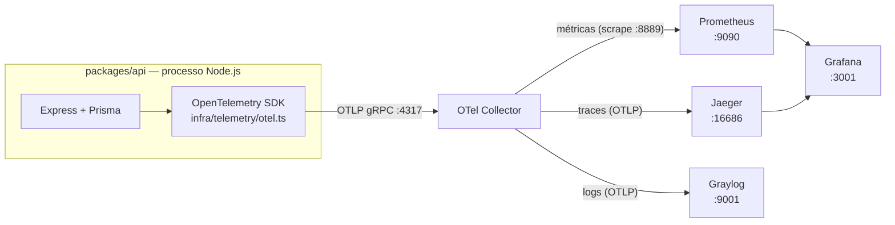
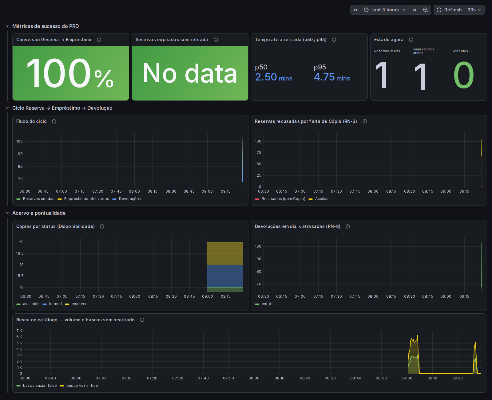
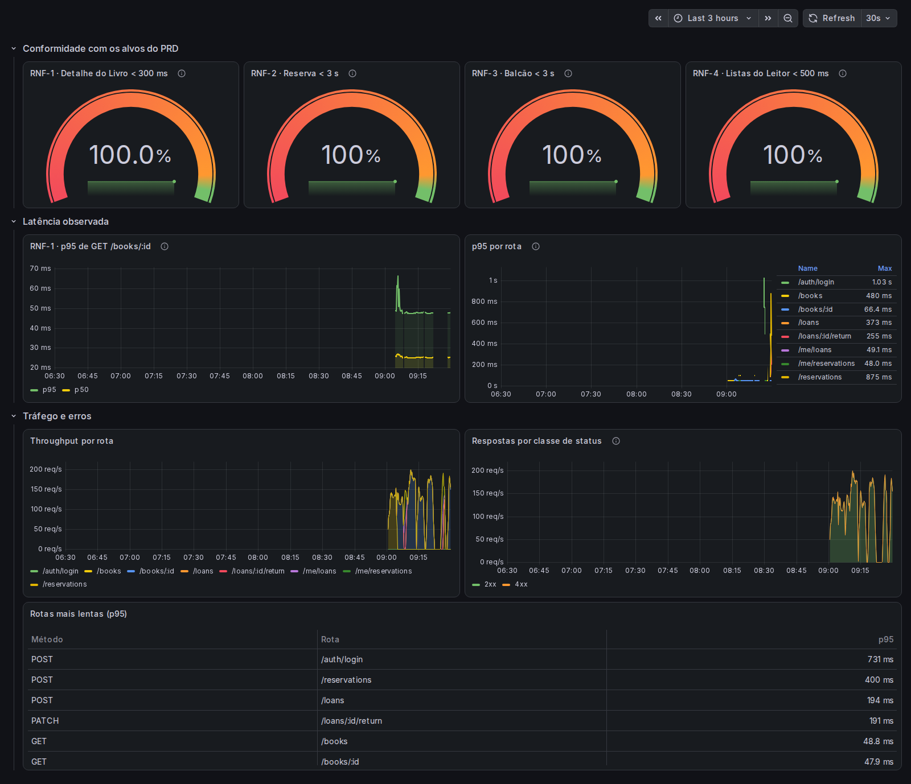
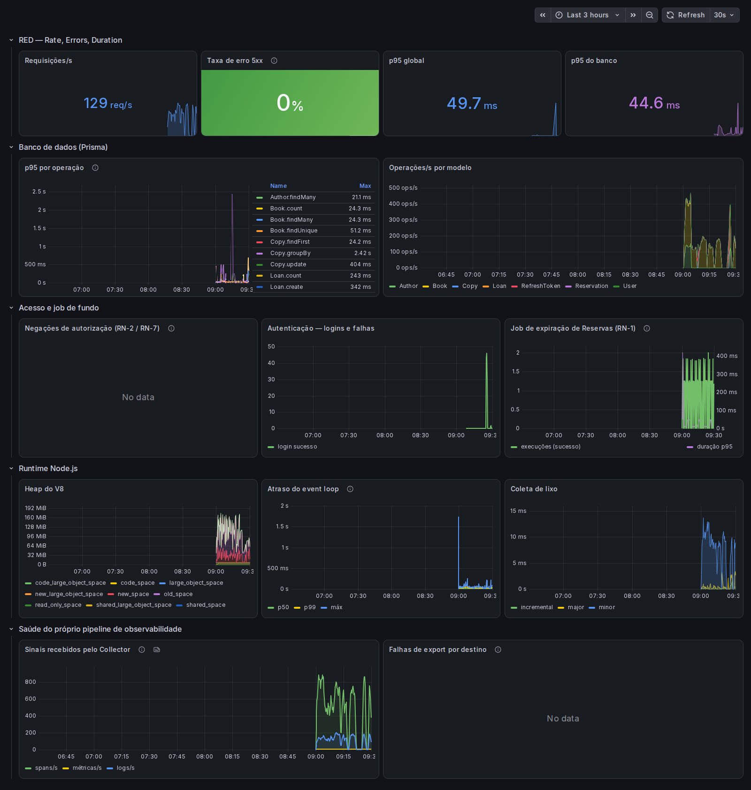
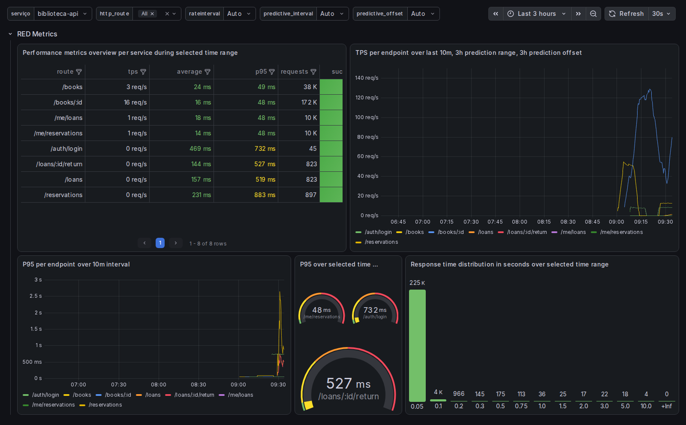

# Observabilidade

Como o módulo backend (`packages/api`) é observado: logs, métricas e traces
emitidos por um único SDK — o **OpenTelemetry** — exportados por **OTLP** para um
Collector que distribui cada sinal ao backend especializado.

Decisão registrada em [ADR-0007](decisoes/0007-observabilidade.md).

---

## 1. Por que

Antes disto, o backend era uma caixa-preta. Havia cinco `console.*` na API
inteira, sem formato estruturado, sem correlação entre requisições e sem nível.
O `errorHandler` **não registrava nenhum `AppError`**: um 409 de "sem Cópia
disponível" (RN-3) desaparecia sem deixar rastro de rota, Leitor ou momento.

Ao mesmo tempo, o PRD define alvos duros — detalhe do Livro em menos de 300 ms
(RNF-1), conversão Reserva → Empréstimo acima de 70% (§11) — que só existiam em
execuções manuais de K6 contra um seed sintético. Nada disso era observável em
operação real, e nenhuma regra de negócio emitia sinal.

O objetivo da observabilidade aqui não é "ter dashboards": é responder, a
qualquer momento e sem abrir o banco, a duas perguntas:

1. **Os alvos de latência do PRD estão sendo cumpridos?** (RNF-1 a RNF-4)
2. **O produto está convertendo Reserva em Empréstimo?** (§11 do PRD)

---

## 2. Arquitetura dos sinais



O **Collector é o único endereço que a API conhece**. Trocar o Jaeger por outro
backend de traces é uma mudança de configuração no Collector, não no código.

Se o Collector estiver fora do ar, o exportador OTLP faz retry e desiste em
silêncio: **a API continua funcionando normalmente**. Para descobrir por que
nada chega, ligue `OTEL_DIAG=true`.

### Portas

| Serviço | Host | Para quê |
|---|---|---|
| OTel Collector | `4317` (gRPC) · `4318` (HTTP) | recebe da API |
| OTel Collector | `8888` | telemetria interna (é o pipeline se auto-observando) |
| OTel Collector | `8889` | métricas da aplicação, para o Prometheus raspar |
| OTel Collector | `13133` | health check |
| Jaeger | `16686` | interface de traces |
| Prometheus | `9090` | interface e API de consulta |
| Grafana | `3001` | dashboards (3000 já é a API) |
| Graylog | `9001` | interface e API |

> **Por que o Graylog está na 9001 e não na 9000:** no WSL2 o `localhost` é
> compartilhado com o Windows, e a 9000 costuma já estar tomada por um processo
> fora do Docker. Quando o bind falha, o container sobe **sem rede nenhuma** e o
> sintoma que aparece é `UnknownHostException: mongodb` — um erro que não se
> parece em nada com um conflito de porta.

---

## 3. Logs

Logger estruturado com **pino** (`packages/api/src/shared/logger.ts`). Saída em
JSON, uma linha por evento.

### Campos padrão

| Campo | Origem |
|---|---|
| `level`, `time` (ISO-8601), `msg` | pino |
| `service`, `env`, `pid` | `base` do logger |
| `requestId` | middleware `requestContext` — ecoa `X-Request-Id` do cliente ou gera um UUID |
| `trace_id`, `span_id`, `trace_flags` | injetados pelo `instrumentation-pino` quando há span ativo |

O `X-Request-Id` volta na resposta e está em `exposedHeaders` do CORS, então a
SPA consegue mostrá-lo numa tela de erro — o mesmo identificador liga o que o
usuário vê ao log e ao trace.

### Níveis

- `info` — requisições concluídas com sucesso, ciclo de vida do processo
- `warn` — `AppError` (RN-3 sem Cópia, RN-7 papel errado, validação): erro
  **esperado** de negócio, não defeito
- `error` — qualquer exceção não tratada; também marca o span como `ERROR`

`GET /health` não é registrado: é batido em laço pelo healthcheck do compose e
pelo `webServer` do Playwright.

### Redaction

Campos censurados como `[REDACTED]` antes de sair do processo:
`password`, `passwordHash`, `token`, `accessToken`, `refreshToken`,
`req.headers.authorization`, `req.headers.cookie`, `res.headers.set-cookie`.

### Caminho até o Graylog

O `@opentelemetry/instrumentation-pino` faz duas coisas ao mesmo tempo: injeta o
contexto de trace no log e envia **o mesmo registro** ao Logs SDK, que o exporta
por OTLP. Não há transporte paralelo nem worker thread; o stdout continua
funcionando para `docker logs`.

No Graylog os campos OTLP ganham prefixo: `otel_trace_id`, `otel_span_id`,
`otel_attributes_*`, `otel_resource_attributes_*`. **É por `otel_trace_id` que se
salta do log para o trace no Jaeger.**

---

## 4. Traces

### Instrumentação automática

Três instrumentações explícitas, não o pacote `auto-instrumentations-node`:

| Instrumentação | O que gera |
|---|---|
| `instrumentation-http` | span raiz por requisição + a métrica `http.server.request.duration` |
| `instrumentation-express` | span por rota (`GET /books/:id`), sem span por middleware |
| `instrumentation-pino` | correlação e envio dos logs |
| `instrumentation-runtime-node` | métricas de heap, event loop e GC |

O pacote `auto-instrumentations-node` foi descartado de propósito: o Prisma fala
com o Postgres por um engine em Rust, então o `instrumentation-pg` não captaria
nada, e o resto do pacote (aws, kafka, redis, graphql) seria peso morto no
`npm ci`.

### Spans manuais

| Span | Onde | Por quê |
|---|---|---|
| `prisma <Modelo>.<operação>` | extensão `$extends` em `infra/prisma.ts` | dá visibilidade de banco sem `@prisma/instrumentation` (ver ADR-0007) |
| `job.expirar_reservas` | `infra/jobs/expireReservations.ts` | cada execução do job vira um trace raiz, com os spans do Prisma como filhos |

`domain/` **não importa `@opentelemetry/api`**. A camada de domínio é regra de
negócio pura e continua testável sem SDK — ver [ARCHITECTURE.md](../ARCHITECTURE.md).

---

## 5. Métricas customizadas

Declaradas em um único módulo: `packages/api/src/infra/telemetry/metrics.ts`.

> **Cardinalidade:** id de Livro, Leitor ou Reserva **nunca** é atributo de
> métrica — cada valor distinto criaria uma série no Prometheus. Ids são
> atributo de span. Todos os atributos abaixo têm no máximo três valores.

### Negócio

| Métrica | Tipo | Atributos | Emitida em | Responde |
|---|---|---|---|---|
| `biblioteca.reservas.criadas` | Counter | `resultado`: `criada` / `sem_copia` / `erro` | `routes/reservations.ts` | volume de Reservas e quanto a RN-3 está barrando |
| `biblioteca.reservas.expiradas` | Counter | — | `jobs/expireReservations.ts` | RN-1 / RN-5 |
| `biblioteca.emprestimos.efetivados` | Counter | — | `routes/loans.ts` | numerador da conversão |
| `biblioteca.devolucoes` | Counter | `situacao`: `em_dia` / `atrasado` | `routes/loans.ts` | pontualidade (RN-8) |
| `biblioteca.reserva.conversao.duracao` | Histogram (s) | — | `repositories/loanRepository.ts` | quanto o Leitor demora entre reservar e retirar |
| `biblioteca.catalogo.buscas` | Counter | `busca_vazia`: `true` / `false` | `routes/books.ts` | qualidade da busca |
| `biblioteca.catalogo.resultados` | Histogram | `busca_vazia` | `routes/books.ts` | tamanho do resultado |
| `biblioteca.reservas.ativas` | ObservableGauge | — | `telemetry/businessGauges.ts` | estado agora |
| `biblioteca.emprestimos.ativos` | ObservableGauge | — | idem | fila do balcão |
| `biblioteca.emprestimos.vencidos` | ObservableGauge | — | idem | RN-8 estourada |
| `biblioteca.copias` | ObservableGauge | `status`: `available` / `reserved` / `loaned` | idem | Disponibilidade do acervo |

A conversão Reserva → Empréstimo (> 70%) e a taxa de Reservas expiradas (< 20%)
não são métricas próprias: são **razões** entre os contadores acima, calculadas
no dashboard. Assim a definição fica visível e ajustável sem mexer no código.

### Técnicas

| Métrica | Tipo | Atributos | Emitida em |
|---|---|---|---|
| `http.server.request.duration` | Histogram (s) | `http.route`, `http.request.method`, `http.response.status_code` | automática, com buckets alinhados aos SLOs |
| `db.client.operation.duration` | Histogram (s) | `db.collection.name`, `db.operation.name` | extensão do Prisma |
| `biblioteca.autorizacao.negacoes` | Counter | `papel_requerido`, `papel_usuario` | `middleware/auth.ts` (RN-2 / RN-7) |
| `biblioteca.autenticacao.falhas` | Counter | `motivo`: `sem_token` / `expirado` / `invalido` | `middleware/auth.ts` |
| `biblioteca.logins` | Counter | `resultado`, `papel` | `routes/auth.ts` |
| `biblioteca.job.execucoes` | Counter | `nome_job`, `resultado` | `jobs/expireReservations.ts` |
| `biblioteca.job.duracao` | Histogram (s) | `nome_job` | idem |

### Dois detalhes que decidem se os dashboards funcionam

**`OTEL_SEMCONV_STABILITY_OPT_IN=http` é obrigatória.** Sem ela, a instrumentação
emite a semântica antiga — `http.server.duration` em **milissegundos**, com
`http.method` / `http.status_code`. Com ela, emite a estável
`http.server.request.duration` em **segundos**, com `http.route` /
`http.request.method` / `http.response.status_code`. Toda a PromQL dos
dashboards assume a segunda.

**Os buckets do histograma HTTP são customizados por necessidade, não por
gosto.** As fronteiras são `0,05 · 0,1 · 0,2 · 0,3 · 0,5 · 0,75 · 1 · 1,5 · 2 · 3
· 5 · 10` segundos. Os valores `0,3`, `0,5` e `3` são exatamente os alvos de
RNF-1, RNF-4 e RNF-2/3 — é isso que torna "% de requisições dentro do alvo" uma
razão exata de buckets, em vez de uma interpolação. Os defaults do OpenTelemetry
pulam de `0,25` para `0,5`, o que erraria o RNF-1 por 50 ms.

### Armadilha: a fronteira do bucket é `le="3.0"`, não `le="3"`

O exporter Prometheus renderiza as fronteiras como float. `0.3` e `0.5` casam
como escritos, mas `3` vira `3.0` — uma consulta com `le="3"` devolve **No data**
em vez de erro. Foi o que aconteceu com os medidores de RNF-2 e RNF-3 na
primeira versão dos dashboards.

### Armadilha: o atributo não pode se chamar `job`

O exporter Prometheus do Collector já usa `job` como label (derivado de
`service.name`). Uma métrica com um atributo chamado `job` é **descartada
inteira**, com este erro no log do Collector:

```
failed to convert metric biblioteca.job.execucoes:
duplicate label names in constant and variable labels
```

Nenhum erro aparece do lado da aplicação — a métrica simplesmente nunca chega ao
Prometheus. Por isso o atributo do job se chama `nome_job`.

---

## 6. Dashboards

Quatro dashboards, versionados em `observabilidade/grafana/dashboards/*.json` e
carregados por provisionamento de arquivo. Editar pela interface não persiste: a
fonte de verdade é o JSON no git.

Três são escritos à mão e recortados para o PRD; o quarto (§6.4) vem do
marketplace da Grafana e não conhece este projeto — só a semantic convention.

### 6.1 `Biblioteca — Negócio`

Responde às métricas de sucesso do PRD §11. Painéis:

- **Conversão Reserva → Empréstimo** — alvo > 70%, verde a partir daí
- **Reservas expiradas sem retirada** — alvo < 20%, vermelho a partir de 40%
- **Tempo até a retirada (p50 / p95)** — teto natural de 12 h pela RN-1
- **Estado agora** — Reservas ativas, Empréstimos ativos e vencidos
- **Fluxo do ciclo** — Reservas criadas × Empréstimos × Devoluções × expiradas
- **Reservas recusadas por falta de Cópia (RN-3)** — a demanda que o acervo não atendeu
- **Cópias por status** — a Disponibilidade, fonte única de verdade entre Leitor e Bibliotecário
- **Devoluções em dia × atrasadas (RN-8)**
- **Busca no catálogo** — volume e proporção de buscas sem resultado

### 6.2 `Biblioteca — SLO de Performance`

Um painel por requisito de latência do PRD:

- **Quatro gauges de conformidade** — % de requisições dentro do alvo de RNF-1
  (300 ms), RNF-2 (3 s), RNF-3 (3 s) e RNF-4 (500 ms)
- **p95 de `GET /books/:id`** com a linha do alvo desenhada em 300 ms
- **p95 por rota** — para localizar qual endpoint saiu do lugar
- **Throughput por rota** e **respostas por classe de status**
- **Tabela de rotas mais lentas**

### 6.3 `Biblioteca — Saúde da API`

- **RED** — requisições/s, taxa de erro 5xx, p95 global, p95 do banco
- **Banco** — p95 e operações/s por modelo e operação do Prisma
- **Negações de autorização (RN-2 / RN-7)** — ação de balcão tentada por Leitor
- **Autenticação** — logins e falhas de token por motivo
- **Job de expiração (RN-1)** — execuções e duração; se as execuções pararem,
  Reservas vencidas deixam de liberar Cópias
- **Runtime Node** — heap do V8, atraso do event loop, coleta de lixo
- **Saúde do próprio pipeline** — sinais recebidos pelo Collector e falhas de
  export por destino

O último painel é deliberado: quando um dashboard fica vazio, a primeira
pergunta é "o sistema parou ou a telemetria parou?". Esse painel responde.

### 6.4 `OpenTelemetry — Serviços HTTP`

Importado do [marketplace da Grafana](https://grafana.com/grafana/dashboards/21587-opentelemetry-for-http-services/)
— dashboard **21587**, revisão 2, Apache-2.0.

O valor dele não é o que mostra, e sim o que prova: **nenhum `expr` de Prometheus
foi reescrito**. O autor nunca ouviu falar de Livro, Reserva ou Empréstimo; ele
só sabe consultar `http_server_request_duration_seconds_*` com `http_route` e
`job`. Se os painéis enchem, a instrumentação segue a semantic convention
estável do OTel — e a stack aceita qualquer ferramenta de terceiros que fale a
mesma convenção. É o teste de portabilidade que os três dashboards escritos à
mão, por construção, não conseguem fazer.

Painéis:

- **Performance metrics overview per service** — tabela RED por endpoint no
  intervalo selecionado: TPS, tempo total, p95 e contagem de erros
- **TPS per endpoint** — throughput por rota mais uma linha de previsão
  (`double_exponential_smoothing`)
- **P95 per endpoint** — latência por rota na janela de `$rateinterval`
- **P95 over selected time range** — gauge do p95 agregado
- **Response time distribution** — quantas requisições caíram em cada bucket do
  histograma; é a leitura direta das fronteiras definidas na view de `otel.ts`

Variáveis: `serviço` (o `job` do Prometheus) e `http_route` (multisseleção).

**Adaptações feitas ao importar** — registradas também no campo `description` do
JSON, para que uma futura reimportação saiba o que reaplicar:

1. Datasource fixado no uid provisionado `prometheus` (o original vem com
   `__inputs` de importação manual).
2. Removidos dois painéis: o `nodeGraph` "Service Mesh" exige **Tempo** e o
   painel de logs exige **Loki** — aqui os backends são Jaeger e Graylog.
3. Removidas as variáveis `service_namespace` / `service_name`, que o upstream
   derivava de `job="namespace/serviço"` por regex. O nosso `job` é
   `biblioteca-api`, sem barra: a cadeia resolveria vazia e levaria todos os
   painéis junto.
4. Query variables passadas para `qryType: 5` (*Classic query*). O upstream
   usava `qryType: 1` (*Label values*), que espera os campos `label` e `metric`
   separados — com a string `label_values(...)` no lugar, o seletor resolve
   vazio e o dashboard inteiro fica sem dados. Sintoma enganoso: os painéis não
   dão erro, só ficam em branco.
5. Alturas dos painéis ajustadas para caber as rotas reais sem paginar.

**Armadilha:** o painel de TPS usa `double_exponential_smoothing()`, função
**experimental** do PromQL 3.x. Sem
`--enable-feature=promql-experimental-functions` no `command` do serviço
`prometheus` (`docker-compose.yml`), o painel não fica vazio — ele falha com erro
de parse. A flag é opt-in e não afeta as queries dos outros dashboards.

---

## 7. Como rodar

```bash
docker compose up -d --wait   # Postgres (perfil default)
make obs-up                   # stack de observabilidade + input do Graylog
make dev-api                  # a API (só ela — ver nota de memória abaixo)
make obs-status               # verifica o pipeline inteiro
```

| Serviço | URL | Credenciais |
|---|---|---|
| Grafana | http://localhost:3001 | `admin` / `admin` (leitura anônima liberada) |
| Jaeger | http://localhost:16686 | — |
| Prometheus | http://localhost:9090 | — |
| Graylog | http://localhost:9001 | `admin` / `admin` |

Alvos disponíveis: `obs-up`, `obs-down` (preserva dados), `obs-clean` (apaga),
`obs-status`, `obs-logs`, `obs-dashboards`.

### Memória

A stack roda em WSL2 com 6 GB. Cada serviço tem `mem_limit` no
`docker-compose.yml` e as JVMs do Graylog e do Data Node estão limitadas a 512 MB
de heap — sem isso, o Data Node sozinho consome ~3 GB e derruba o resto.

O Jaeger tem `mem_limit: 1g` porque guarda os traces **em memória, sem volume**:
com 512 MB, uma rodada de carga K6 fazia o cgroup matar o processo (o kernel
registra `Killed process ... (jaeger-linux)`) e todo o histórico de traces ia
junto — sem nada no log do container, porque o processo morre antes de conseguir
escrever. Se voltar a acontecer sob carga maior, o sintoma é a UI do Jaeger
mostrar só traces recentes: confira `docker inspect biblioteca-jaeger --format
'{{.RestartCount}}'`.

**Durante a validação, use `make dev-api` e não `make dev`:** o Vite do
`packages/web` não é necessário para gerar carga nem para capturar dashboards.
Se ainda faltar memória, aumente `memory=10GB` no `%UserProfile%\.wslconfig` e
rode `wsl --shutdown`.

### Primeiro boot do Graylog

O Graylog 6.2+ sobe em modo *preflight*: um assistente que normalmente exige
cliques no navegador para criar a autoridade certificadora e provisionar os
certificados do Data Node. O `observabilidade/graylog/provisionar-input.sh` faz
isso pela API (`/api/ca/create` → `/api/renewal_policy` → `/api/generate` →
`/api/status/finish-config`) e depois cria o input OpenTelemetry gRPC. É
idempotente e roda automaticamente no `make obs-up`.

Para fazer manualmente: acesse http://localhost:9001, use a senha impressa em
`docker logs biblioteca-graylog`, conclua o assistente e crie um input
**OpenTelemetry (gRPC)** global na porta `4317` com **Allow Insecure
Connections** marcado.

> **Sem esse input, o Graylog fica vazio e o Collector acumula
> `connection refused` no pipeline de logs.** É a falha mais provável ao montar
> esta stack.

### Perfil de teste

O SDK é desligado automaticamente quando `NODE_ENV=test`, e também por
`OTEL_SDK_DISABLED=true`. Os testes do Vitest importam `app.ts`, nunca
`index.ts`, então nada de OpenTelemetry é carregado: os instrumentos vêm da API
no-op do `@opentelemetry/api` e todo `.add()` / `.record()` é uma chamada vazia.
O `playwright.config.ts` também define `OTEL_SDK_DISABLED=true`.

### Variáveis de ambiente

Todas em [`.env.example`](../.env.example): `OTEL_EXPORTER_OTLP_ENDPOINT`,
`OTEL_EXPORTER_OTLP_PROTOCOL`, `OTEL_SERVICE_NAME`, `OTEL_SERVICE_VERSION`,
`OTEL_SDK_DISABLED`, `OTEL_METRIC_EXPORT_INTERVAL`,
`OTEL_SEMCONV_STABILITY_OPT_IN`, `OTEL_DIAG`, `LOG_LEVEL`,
`BUSINESS_GAUGES_ENABLED`, `BUSINESS_GAUGES_TTL_MS`.

---

## 8. Gerar dados para os dashboards

A suíte K6 em [`perf/`](../perf/README.md) já exercita todos os endpoints e já
mapeia 1:1 os RNFs. Não é preciso o seed de 250 mil Livros — o de
desenvolvimento basta para popular os painéis:

```bash
k6 run -e VUS=4  -e DURATION=4m perf/scenarios/book-detail.js
k6 run -e SEARCH_VUS=3 -e DURATION=3m perf/scenarios/catalog-search.js
k6 run -e VUS=3  -e DURATION=3m perf/scenarios/reader-lists.js
k6 run -e WRITE_RATE=2 -e WRITE_DURATION=4m perf/scenarios/loan-return.js
```

O `loan-return.js` é o que alimenta os painéis de negócio: executa a cadeia
Reserva → Empréstimo → Devolução, e o 409 sob contenção alimenta
`resultado="sem_copia"` (RN-3).

---

## 9. Os dashboards

Capturas geradas com Playwright a partir do Grafana real, depois da carga K6 da
seção anterior (`make obs-dashboards`).

### Biblioteca — Negócio



### Biblioteca — SLO de Performance



### Biblioteca — Saúde da API



### OpenTelemetry — Serviços HTTP



---

## 10. Diagnóstico

| Sintoma | Onde olhar |
|---|---|
| Nada chega ao Collector | `OTEL_DIAG=true` na API; `curl localhost:13133` |
| Métrica não aparece no Prometheus | `docker logs biblioteca-otel-collector \| grep "failed to convert"` — quase sempre colisão de nome de label |
| Graylog vazio | o input OTel existe? `curl -u admin:admin localhost:9001/api/system/inputs` |
| Dashboard vazio | painel "Saúde do próprio pipeline" no dashboard de Saúde da API |
| Painel de TPS do §6.4 com erro de parse | falta `--enable-feature=promql-experimental-functions` no serviço `prometheus` |
| Painel "Datasource not found" | o JSON referencia Tempo/Loki — só existem `prometheus` e `jaeger` em `provisioning/datasources/` |
| Dashboard inteiro em branco, sem erro | seletor de variável vazio: query variable do Prometheus com `qryType: 1` e a string `label_values(...)`. Use `qryType: 5` |
| Pipeline inteiro | `make obs-status` |
